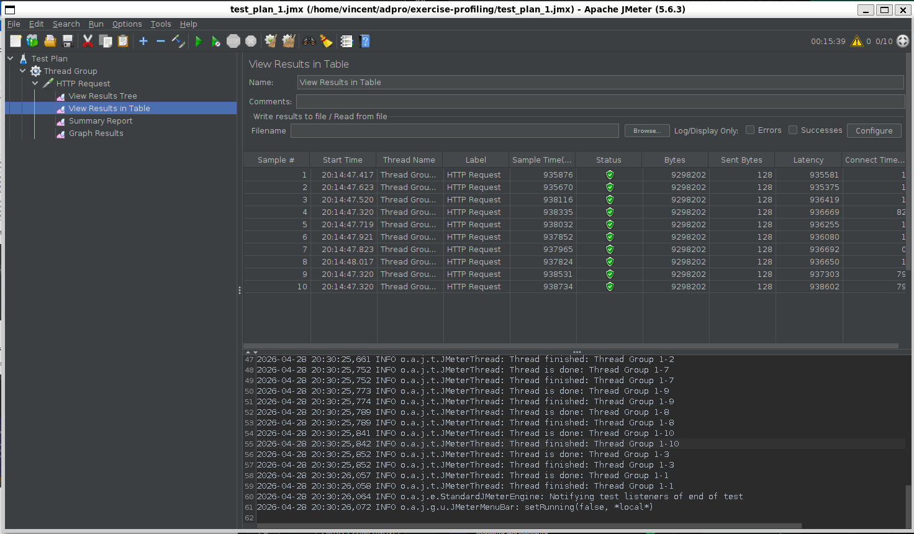
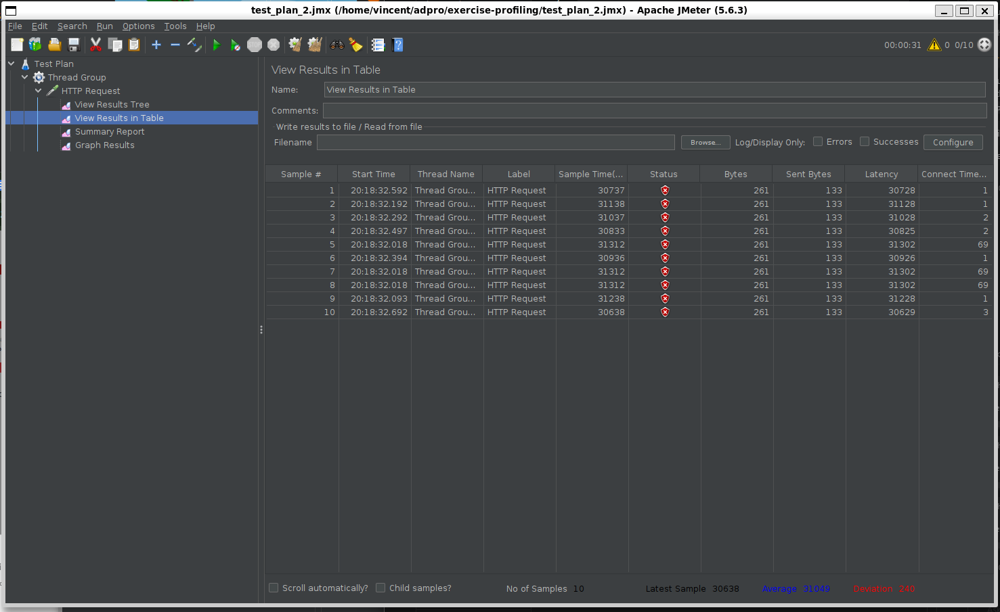
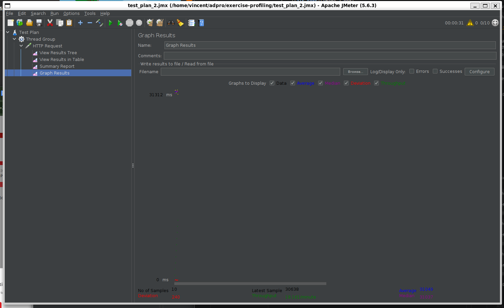
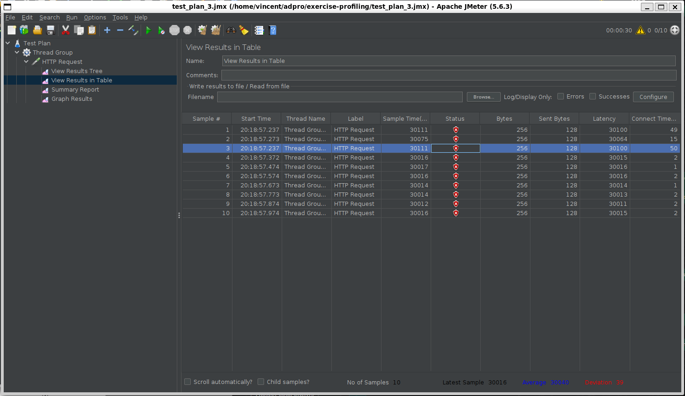
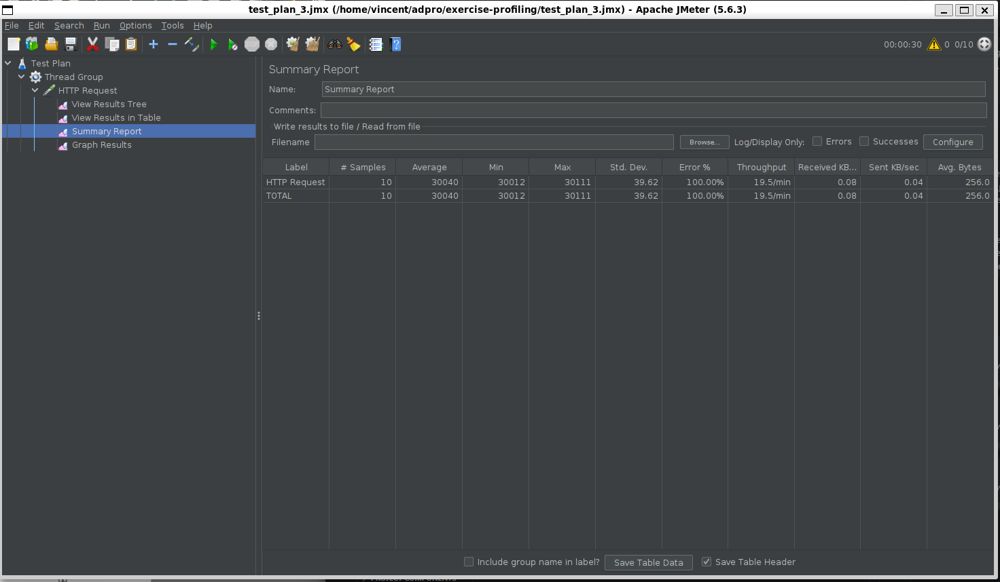
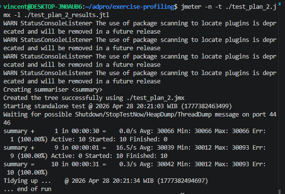
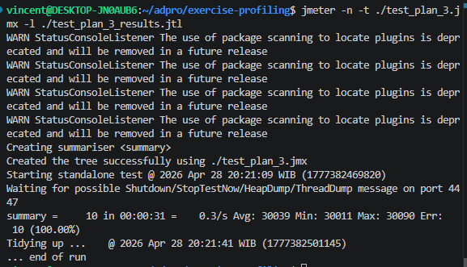

Via gui

Via cli

Baseline results were taken from:

- `test_plan_1_results.jtl`
- `test_plan_2_results.jtl`
- `test_plan_3_results.jtl`

Post-optimization results were taken from:

- `test_plan_1_results_after.jtl`
- `test_plan_2_results_after.jtl`
- `test_plan_3_results_after.jtl`

| Test Plan | Endpoint | Before | After | Improvement |
| --- | --- | --- | --- | --- |
| Test Plan 1 | `/all-student` | avg `30053.50 ms`, `100%` error | avg `19375.20 ms`, `0%` error | `35.53%` faster and errors removed |
| Test Plan 2 | `/all-student-name` | avg `30042.40 ms`, `100%` error | avg `672.20 ms`, `0%` error | `97.76%` faster and errors removed |
| Test Plan 3 | `/highest-gpa` | avg `30039.50 ms`, `100%` error | avg `90.00 ms`, `0%` error | `99.70%` faster and errors removed |

The profiling comparison used:

- `profile-test-plan-1.jfr` as the baseline profile
- `profile-test-plan-1.2.jfr` as the post-optimization profile

- Baseline recording duration was `828 s`, while the optimized recording completed in `33 s`.
- `jdk.NativeMethodSample` dropped from `40567` to `1191`.
- `jdk.SocketRead` dropped from `20584` to `26`.
- The optimized profile shows much less time blocked on waiting and database/network activity, which matches the JMeter improvement.

There is a clear improvement from the JMeter measurements after the profiling and optimization process.

Before optimization, all three test plans ended in `500` responses and took around `30 seconds` on average, which indicates the requests were effectively timing out or failing under load. After optimization, all three plans completed successfully with `0%` errors.

The biggest improvements were on `/all-student-name` and `/highest-gpa`, because those endpoints previously loaded unnecessary data and did extra work in memory. `/all-student` also improved, but it is still the slowest endpoint because it returns a very large payload for all student-course rows. 

## Reflection

### 1. Difference between JMeter and IntelliJ Profiler

JMeter and IntelliJ Profiler solve different performance questions. JMeter is used to measure external behavior such as response time, throughput, error rate, and how the application behaves under concurrent requests. IntelliJ Profiler is used to inspect internal behavior such as which methods consume CPU time, where memory allocations happen, and where threads spend time waiting or blocking. In short, JMeter tells us that the application is slow, while the profiler helps explain why it is slow.

### 2. How profiling helps identify weak points

Profiling helps by showing where execution time and resources are actually spent inside the application. In this project, it helped reveal that the slow endpoints were not only affected by controller response size, but also by inefficient service and repository logic such as loading too much data, repeated database access, and unnecessary in-memory processing. That made it easier to focus optimization on the real hotspots instead of guessing.

### 3. Effectiveness of IntelliJ Profiler

Yes, IntelliJ Profiler is effective for analyzing bottlenecks in application code. It is especially useful because it gives a direct view of hot methods, call stacks, thread activity, and allocation patterns. In this case, it supported the conclusion that the application spent too much time on database-related work and request processing before the code was optimized.

### 4. Main challenges during performance testing and profiling

The main challenges are keeping the test environment stable, making sure the application is running with realistic data, and separating real bottlenecks from noise. Another challenge is that failing requests can distort performance numbers, because a timeout or `500` error may look like a slow endpoint even when the real issue is deeper in the code. These challenges were handled by reseeding the application data, rerunning the tests after optimization, and comparing both JMeter results and profiling results together instead of relying on only one tool.

### 5. Main benefits of IntelliJ Profiler

The biggest benefits are visibility and precision. IntelliJ Profiler helps show which code paths are expensive, whether time is spent on CPU work or waiting, and whether memory allocation is excessive. This shortens the optimization cycle because changes can be guided by evidence rather than assumptions.

### 6. Handling inconsistent profiler and JMeter results

If profiler results and JMeter results are not fully consistent, the best approach is to treat them as complementary rather than contradictory. JMeter measures user-facing performance, while the profiler measures internal execution details. I would repeat the tests under the same dataset and workload, check whether caching, warm-up, or database state affected the results, and then compare multiple runs. The final conclusion should be based on repeatable trends, not a single measurement.

### 7. Optimization strategy and functional safety

The optimization strategy used here was to reduce unnecessary work and move more efficient operations closer to the database. For `/all-student`, the N+1 query pattern was replaced with a fetch join. For `/all-student-name`, only the required column was queried and string construction was simplified. For `/highest-gpa`, the highest GPA student was fetched directly from the database instead of scanning all rows in Java.

To make sure the optimizations do not break functionality, the application should be retested after each change. In this project, that was done by recompiling the project, rerunning the endpoints, and repeating JMeter performance tests. The fact that the optimized endpoints returned successful responses with much lower latency showed that performance improved without changing the intended endpoint behavior.
